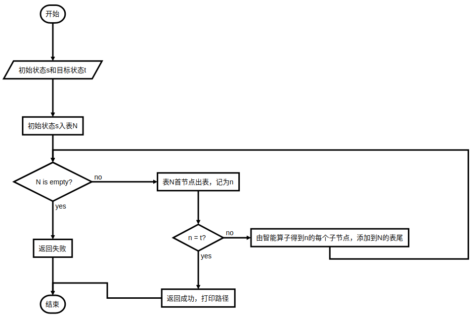
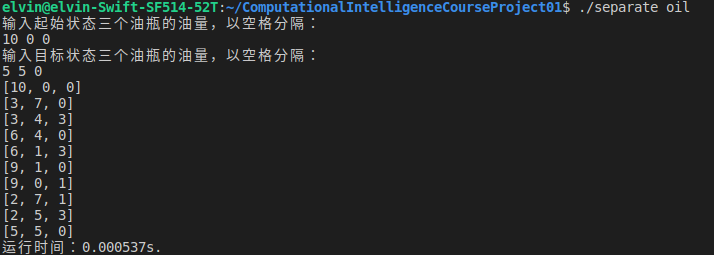

# 问题描述

两个小孩去打油，一人带了一个一斤的空瓶，另一个带了一个七两、一个三两的空瓶。原计划各打一斤油，可是由于所带的钱不够，只好两人合打了一斤油，在回家的路上，两人想平分这一斤油，可是又没有其它工具。试仅用三个瓶子(一斤、七两、三两)精确地分出两个半斤油来。


# 算法设计

## 算法思想

通过智能算子构造三个油瓶的状态树，利用广度优先搜索算法在状态树上搜索满足条件的状态，最后打印出从状态树的根节点到目标状态所在节点的路径。


## 算法步骤

1. 记访问表为N，初始状态入表
2. 若表为空，返回失败
3. 表首节点出表，记为当前状态n，若n为目标状态，打印路径并返回成功；否则继续第4步
4. 根据智能算子得到状态n的子状态，依次添加到N的表尾，返回第2步


<p style="page-break-before: always">

# 程序流程




<p style="page-break-before: always">

# 核心伪代码
```c++
0   SeparateOil(n)
1       enQueue(n)
2       while(!queueIsEmpty())
3           deQueue(n)
4           if(isTarget(n))
5               printPath and return success
6       getChildrenEnQueue(n)
7       return fail
8
9   getChildrenEnQueue(n)
10      if(n.m < 7) enQueue(10-7-n.s, 7, n.s)
11      if(n.s < 3) enQueue(10-3-n.m, n.m, 3)
12      if(n.m > 0) enQueue(B-n.s, 0, n.s)
13      if(n.s > 0) enQueue(B-n.m, n.m, 0)
14      if(n.m + n.s < 3)   enQueue(n.b, 0, n.s+n.m)
15      if(n.m + n.s < 7)   enQueue(n.b, n.s+n.m, 0)
16      if(n.m + n.s >= 7)  enQueue(n.b, 7, n.s+n.m-7)
17      if(n.m + n.s >= 3)  enQueue(n.b, n.s+n.m-3, 3)
```

#代码运行及测试



# 结论
1. 本实验采用广度优先搜索算法，保证最终得到的分油方案是最优的(操作次数最少)，但这种算法的空间复杂度较大。为了降低空间复杂度，在每个节点入访问表前，检查其是否是重复节点，若重复则不再入表。
2. 本实验的代码适用于10两，7两，3两的分油问题，将常量10，7，3替换成B(big)，M(middle)，S(small)符号，能够提高通用性。

